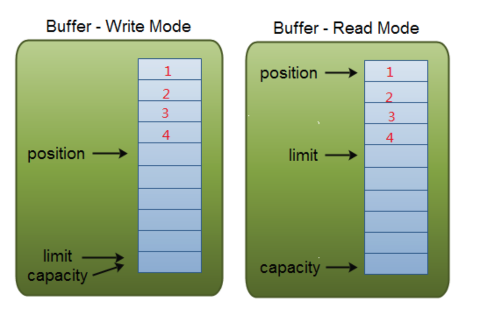
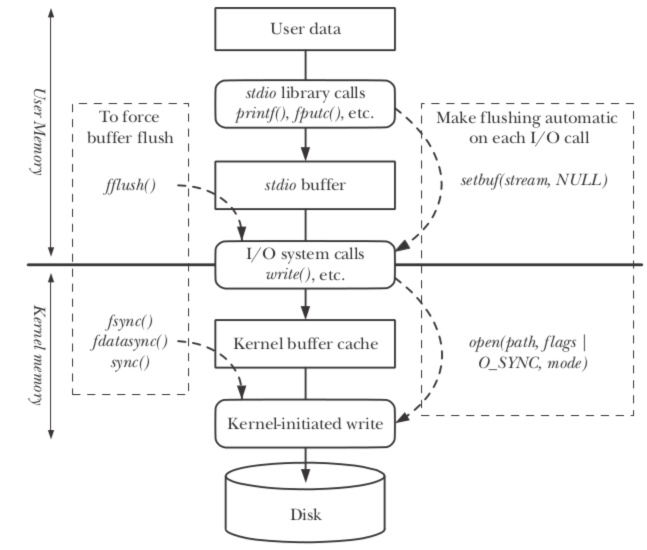
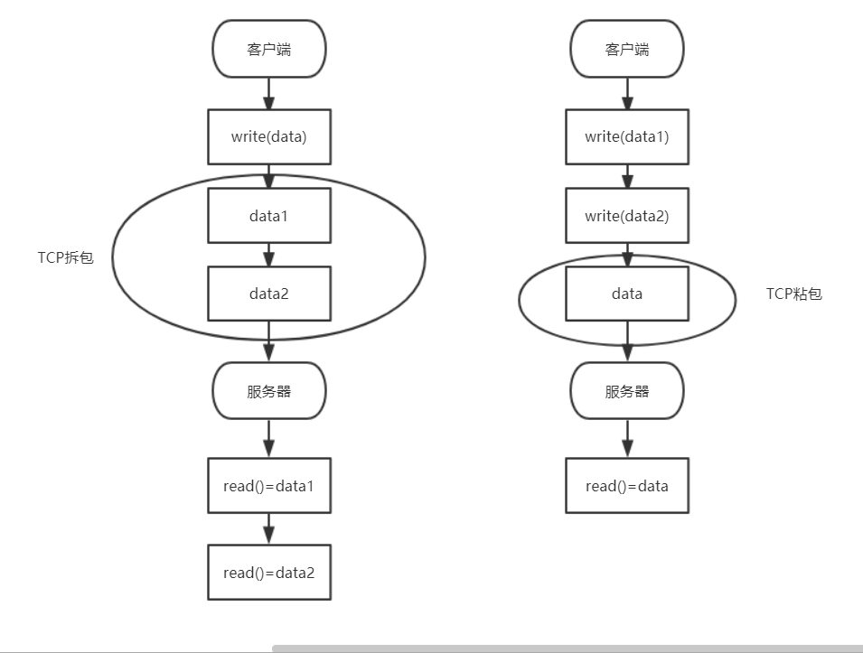

## 文件IO流

先定义一个`byte[]`数组作为缓冲区,`read()`方法会尽可能多地读取字节到缓冲区，`read`方法的返回值变为实际读取了多少字节。

```java
public static void main(String[] args) throws Exception {
    InputStream input = null;
    try {
        input = new FileInputStream("./src/readme.txt");
        byte [] buffer = new byte[100]; //设置缓冲区
        int n ;
        while((n = input.read(buffer)) != -1){
            System.out.println(n);
        }
    }finally {
        if(input != null) input.close();
    }
}
```

获取不同功能的`InputStream`(使用装饰者的设计模式)

```Java
InputStream file = new FileInputStream("test.gz");
InputStream buffered = new BufferedInputStream(file);
InputStream gzip = new GZIPInputStream(buffered);
```

把资源存储在`classpath`中可以避免文件路径依赖；

`Reader`定义了所有字符输入流的超类：

- `FileReader`实现了文件字符流输入，使用时需要指定编码；
- `CharArrayReader`和`StringReader`可以在内存中模拟一个字符流输入。

`Reader`是带编码转换器的`InputStream`，它把`byte`转换为`char`，而`Writer`就是带编码转换器的`OutputStream`，它把`char`转换为`byte`并输出。

```java
public void readFile() throws IOException {
    try (Reader reader = new FileReader("src/readme.txt", StandardCharsets.UTF_8)) {
        char[] buffer = new char[1000];
        int n;
        while ((n = reader.read(buffer)) != -1) {
            System.out.println("read " + n + " chars.");
        }
    }
    try (Writer writer = new FileWriter("readme.txt", StandardCharsets.UTF_8)) {
        writer.write('H'); // 写入单个字符
        writer.write("Hello".toCharArray()); // 写入char[]
        writer.write("Hello"); // 写入String
    }
}
```

## Java句柄

对象句柄：一个唯一的整数，作为对象的身份id，区别不同的对象，操纵Java对象的其实是指向一个对象的句柄（Handle）

## == and equals

```java
String s1 = "Monday";
String s2 = "Monday";
s1 == s2; // true

String s1 = "Monday";
String s2 = new String("Monday");
s1==s2;    //false
s1.equals(s2);   //true

// == 操作比较的是两个变量的值是否相同，对于引用型变量表示的是两个变量在堆中存储的地址是否相同

// equals:表示两个变量是否是对同一个对象的引用，即堆中的内容是否相同

// 程序在运行的时候会创建一个字符串缓冲池当使用 s2 = "Monday" 这样的表达是创建字符串的时候，程序首先会在这个String缓冲池中寻找相同值的对象，在第一个程序中，s1先被放到了池中，所以在s2被创建的时候，程序找到了具有相同值的 s1
```

## Java继承和多态

子类继承父类的除了private的所有属性

Java实现多态三个必要条件，继承、重写和向上转型(父类引用指向子类对象)

多态的实现方式：

1. 继承父类方法进行重写
2. 抽象类和抽象方法
3. 接口实现

向上转型，在运行的，会遗忘子类对象中与父类对象中不同的方法，也会覆盖与父类中相同的方法——重写（方法名，参数都相同）

总结：

1. 使用父类类型的引用指向子类的对象，该引用只能调用父类中定义的方法和变量
2. 如果子类中重写了父类的一个方法，那么在调用这个方法的时候，将会调用子类中的方法
3. 变量不能重写，重写的概念只适用于方法

## Interface

```java
interface Instrument{
    int VLAUE = 5; // static & final
    void play(Note n); // Automatically public
}
```

## 内部类

```java
package JavaSE.InnerClass;

public class People {
    private String name = "MissBear";
    
    public class Student{
        public String ID = "1004173119";

        public void stuInfo(){
            System.out.println("outer " + name);
            System.out.println("inner  "+ ID);
            System.out.println(People.this.name); // 访问外部变量
        }
    }
    
    public static void main(String[] args) {
        People p = new People();
        Student b = p.new Student(); // 要通过外部对象生成内部对象
        b.stuInfo();
    }
}
// 成员内部类不能含有 static 的变量和方法，因为成员内部类需要先创建了外部类，才能创建它自己的。
```

## 静态内部类

静态内部类通常被称为嵌套类

1. 静态内部类不能直接访问外部类的非静态成员，但可以通过 `new 外部类().成员` 的方式访问。
2. 如果外部类的静态成员与内部类的成员名称相同，可通过 `类名.静态成员` 访问外部类的静态成员；如果外部类的静态成员与内部类的成员名称不相同，则可通过 `成员名` 直接调用外部类的静态成员。
3. 创建静态内部类的对象时，不需要外部类的对象，可以直接创建 `内部类 对象名 = new 内部类();`。

```java
package JavaSE.InnerClass;

public class People {
    private String name = "MissBear";

    private static final String ID = "312213213413";

    public static class Student{
        String ID = "2012012";

        public void stuInfo(){
            System.out.println("outer :" + (new People().name)); // 通过new 外部类().成员 访问
            System.out.println("outer ID :" + People.ID);
            System.out.println("Inner ID " + ID);
        }
    }

    public static void main(String[] args) {
        Student b = new Student();
        b.stuInfo();
    }
}
```

## 局部内部类

是指内部类定义在我方法和作用域内

局部内部类也像别的类一样进行编译，但只是作用域不同而已，只在该方法或条件的作用域内才能使用，退出这些作用域后无法引用的。

```java
package JavaSE.InnerClass;

public class People {
    public void peopleInfo(){
        final String sex = "man";
        class Student{
            String ID = "21312213";
            public void print(){
                System.out.println("outer :" + sex);
                System.out.println("inner :" + ID);
            }
        }
        Student a = new Student();
        a.print();
    }

    public static void main(String[] args) {
        People p = new People();
        p.peopleInfo();
    }
}
```

## 匿名内部类

```java
package JavaSE.InnerClass;

public class Outer {
    public Inner getInner(final String name, String city){
        return new Inner(){
            private String nameStr = name;
            public String getName(){
                return nameStr;
            }
        };
    }

    public static void main(String[] args) {
        Outer outer = new Outer();
        Inner inner = outer.getInner("Inner", "New York");
        System.out.println(inner.getName());
    }
}

interface Inner{
    String getName();
}
```

匿名内部类是**不能加访问修饰符**的。要注意的是，new 匿名类，这个类是要先定义的, 如果不先定义，编译时会报错该类找不到。

在上面的例子中，当所在的方法的形参需要在内部类里面使用时，该形参必须为 `final`。这里可以看到形参 `name` 已经定义为 `final` 了，而形参 `city` 没有被使用则不用定义为 `final`。

## 泛型

- 只能是引用类型，不能是简单数据类型
- 泛型的参数可以有多个
- 可以用使用extends语句或者super语句 如`<T extends superClass>`表示类型的上界，T只能是superclass或其子类，`<K super childClass>`表示类型的下界，K只能是childClass或其父类
- 可以是通配符类型，比如常见的 `Class<?>`。单独使用 `?` 可以表示任意类型。也可以结合 `extends` 和 `super` 来进行限制

## Integer

```java
// -128到127的值会被Integer类缓存起来

Integer a = 100, b = 100, c = 150, d = 150;
System.out.println(a == b); // tr
System.out.println(c == d);
```

## Junit

```java
import org.junit.After;
import org.junit.Before;
import org.junit.Test;

public class TestJunit {
    @Test
    public void testJava(){
        System.out.println("Hello World");
    }
    @Test
    public void testPython(){
        System.out.println("Hello Vue");
    }
    
    @Before
    public void BeforeTest(){
        System.out.println("Before Code");
    }

    @After
    public void AfterTest(){
        System.out.println("After Code");
    }
}
/* 
@BeforeClass:该方法表示启动测试类对象测试之前启动的方法，必须是static修饰的(可以通过类名直接访问),一般用来打开配置文件,初始化资源等

@AfterClass:该方法表示测试类对象测试完成之后启动的方法, 所以该方法必须是static 修饰的(可以通过类名直接访问).一般用来关闭数据库,结束资源等

@Before:该方法表示调用每个测试方法前都会被调用一次

@After:该方法表示调用每个测试方法后都会被调用一次
*/
```

## Collections

#### Queue

```java
Queue queue = new LinkedList(); // 单向队列
```

- **poll()：**获取并移除此队列的头， 如果队列为空则返回null;
- **remove()：**获取并移除此队列的头，如果此队列为空，则抛出NoSuchElementException异常

- **peek()：**获取队列的头但不移除此队列的头。如果此队列为空，则返回 null
- **element()**：获取队列的头但不移除此队列的头。如果此队列为空，则将抛出NoSuchElementException异常
- **offer()：**将指定的元素插入到此队列中，插入返回true，失败返回false
- **add()：**将指定的元素插入队列

```java
// 默认是小顶堆 可以重写构造器变成大顶堆
Queue<Integer> pq = new PriorityQueue<>((v1, v2) -> v2 - v1);
```

#### Deque

```java
Deque LinkedDeque = new LinkedList(); // 链表双端队列
Deque ArrayDeque = new ArrayDeque(); // 数组双端队列
```

- **addFirst():** 向队头插入元素，如果元素为空，则发生NPE
- **addLast():** 向队尾插入元素，如果为空，则发生NPE
- **offerFirst():** 向队头插入元素，如果插入成功返回true，否则返回false
- **offerLast():** 向队尾插入元素，如果插入成功返回true，否则返回false
- **removeFirst():** 返回并移除队头元素，如果该元素是*null*，则发生*NoSuchElementException*
- **removeLast():** 返回并移除队尾元素，如果该元素是*null*，则发生*NoSuchElementException*
- **pollFirst():** 返回并移除队头元素，如果队列无元素，则返回*null*
- **pollLast():** 返回并移除队尾元素，如果队列无元素，则返回*null*
- **getFirst():** 获取队头元素但不移除，如果队列无元素，则发生*NoSuchElementException*
- **getLast():** 获取队尾元素但不移除，如果队列无元素，则发生*NoSuchElementException*
- **peekFirst():** 获取队头元素但不移除，如果队列无元素，则返回*null*
- **peekLast():** 获取队尾元素但不移除，如果队列无元素，则返回*null*
- **push** ：addFirst()
- **pop**：removeFirst()

#### Stack

- Stack stack = new Stack()；
- **push**();
- **pop**()：取栈顶，并且出栈
- **peek**()：取栈顶，但不出栈
- **empty**();

## 序列化和反序列化

**序列化**是指将对象转换为字节序列的过程，从而实现对象的轻量级存储

**反序列化**就是把持久化的字节文件恢复成对象的过程

实现Serializable接口，其中没有需要实现的方法，会生成一个唯一的serialVersionUID，建议不需要依赖JVM默认生成的UID，应该显式地生成一个SerialVersionUID的字段（数组类不需要显示地声明serialVersionUID）

## Javac和Java

先用`javac`来对`.java`文件进行编译生成`.class`文件

再回到`src`目录下进行`Java`文件的执行 

# On Java 8 

## 第一章 对象的概念

面对对象语言使用**后期绑定**的概念，当向对象发送信息时，被调用的代码直到运行时才确定

```java
void doSomething(Shape shape){
  shape.erase();
  // ...
  shape.draw();
}
```

```java
Circle circle = new Circle();
Triangle triangle = new Triangle();
Line line = new Line();
doSomething(circle);
doSomething(triangle);
doSomething(line);
```

## Java 访问权限

1. private：
2. default：通常称为“默认访问权限”或者“包访问权限”。该模式下，只允许在同一个包中进行访问
3. protected：只能被类本身的方法及其子类访问，即使子类在不同的包中也可以访问

## Java 时间输出格式

```java
String time = "2002-09-1000:00:00.0";
Date date = new SimpleDateFormat("yyyy-MM-ddHH:mm:ss.SSS").parse(time);
System.out.println(new SimpleDateFormat("yyyy-MM").format(date));
```

## 强制转换引起的精度丢失问题

同样适用int和float：为什么int可以直接转换为float，而float不能转换为int，这个因为float表示的数值范围要比int表示的多

## Math.abs()

```java
Math.abs(int)返回的是一个int值;
Math.abs(Integer.MIN_VALUE) // -2147483648
Math.abs((long) Integer.MIN_VALUE) // 2147483648
```

## add(new ArrayList<>(path))


`res.add(new ArrayList(path))`：开辟一个独立地址，地址中存放的内容为item链表，后续item的变化不会影响到res

`res.add(path)`：将res尾部指向了item地址，后续item内容的变化会导致res的变化。

## toArray()和toArray(T[] a) 方法

这两个方法都是将列表的List的元素导出为数组,不同的是toArray()导出的是Object类型的，而toArray[T[] a]导出的是指定类型的数组

```java
    // toArray()
    List<People> list = new ArrayList<>();
    list.add(new People("小明"));
    list.add(new People("小王"));
    Object[] objects1 = list.toArray();
    Object[] objects2 = list.toArray();
    System.out.println("objects1 == objects2 : "+(objects1 == objects2));
    ((People)objects1[1]).name = "小花";
    System.out.println("show objects1: "+ Arrays.toString(objects1));
    System.out.println("show objects2: "+ Arrays.toString(objects2));
    System.out.println("show list: "+list);
    
    objects1 == objects2 : false
    show objects1: [People{name='小明'}, People{name='小花'}]
    show objects2: [People{name='小明'}, People{name='小花'}]
    show list: [People{name='小明'}, People{name='小花'}]
```
list.toArray()返回的数组中存放的是list原始对象的引用，只是创建一个新的数组来存放，并没有对list中原始对象进行拷贝或复制

```java
// toArray(T[] a)
@SuppressWarnings("unchecked")
public <T> T[] toArray(T[] a) {
    if (a.length < size)
        // Make a new array of a's runtime type, but my contents:
        return (T[]) Arrays.copyOf(elementData, size, a.getClass());
    System.arraycopy(elementData, 0, a, 0, size);
    if (a.length > size)
        a[size] = null;
    return a;
}
```

参数长度小于则直接复制并转换为T类型，大于等于则在数组末尾补null


### Integer[] 转化为 int[]

```java
ints = Arrays.stream(integers).mapToInt(Integer::valueOf).toArray();
```

### return int[][]

```java
List<int[]> res = new ArrayList<>();

return res.toArray(new int[res.size()][]);
```

### StringBuilder 删除方法

```java
StringBuilder sb = new StringBuilder();
sb.delete(0, sb.length());
```

### Exception 和 RuntimeException

Exception ：受检查的异常，这种异常是强制我们catch或throw的异常。你遇到这种异常必须进行catch或throw，如果不处理，编译器会报错。比如：IOException。

RuntimeException：运行时异常，这种异常我们不需要处理，完全由虚拟机接管。比如我们常见的NullPointerException，我们在写程序时不会进行catch或throw。


### NIO编程



flip 源码

```java
public final Buffer flip(){
    limit = position;
    position = 0;
    mark = -1;
    return this;
}
```

### I/O模型

**什么是同步？什么是异步？**

同步就是：如果有多个任务或者事件要发生，这些任务或者事件必须逐个地进行，一个事件或者任务的执行会导致整个流程的暂时等待，这些事件没有办法并发地执行；

异步就是：如果有多个任务或者事件发生，这些事件可以并发地执行，一个事件或者任务的执行不会导致整个流程的暂时等待。

**什么是阻塞？什么是非阻塞？**

阻塞就是：当某个事件或者任务在执行过程中，它发出一个请求操作，但是由于该请求操作需要的条件不满足，那么就会一直在那等待，直至条件满足；

非阻塞就是：当某个事件或者任务在执行过程中，它发出一个请求操作，如果该请求操作需要的条件不满足，会立即返回一个标志信息告知条件不满足，不会一直在那等待。

**什么是阻塞IO？什么是非阻塞IO？**

一个完整的IO读请求操作包括两个阶段：

1. 查看数据是否就绪
2. 进行数据拷贝(内核将数据拷贝到用户线程)

当用户线程发起一个IO请求操作，内核会去查看要读取的数据是否就绪，对于阻塞IO来说，如果数据没有就绪，则会一直在那等待，直到数据就绪；对于非阻塞IO来说，如果数据没有就绪，则会返回一个标志信息告知用户线程当前要读的数据没有就绪。

**什么是同步IO？什么是异步IO？**

同步IO：当用户发出IO请求操作之后，如果数据没有就绪，需要通过用户线程或者内核不断地去轮询数据是否就绪，当数据就绪时，再将数据从内核拷贝到用户线程；

异步IO：只有IO请求操作的发出是由用户线程来进行的，IO操作的两个阶段都是由内核自动完成，然后发送通知告知用户线程IO操作已经完成。也就是说在异步IO中，不会对用户线程产生任何阻塞。

同步IO和异步IO的关键区别反映在数据拷贝阶段是由**用户线程**完成还是**内核**完成。所以说异步IO必须要有操作系统的底层支持。

**注意同步IO和异步IO与阻塞IO和非阻塞IO是不同的两组概念。**

阻塞IO和非阻塞IO是反映在当用户请求IO操作时，如果数据没有就绪，是用户线程一直等待数据就绪，还是会收到一个标志信息这一点上面的。也就是说，阻塞IO和非阻塞IO是反映在IO操作的第一个阶段，在查看数据是否就绪时是如何处理的。

### 五种I/O 模型

#### 阻塞I/O模型

当用户线程发出IO请求之后，内核会去查看数据是否就绪，如果没有就绪就会等待数据就绪，而用户线程就会处于阻塞状态，用户线程交出CPU。当数据就绪之后，内核会将数据拷贝到用户线程，并返回结果给用户线程，用户线程才解除block状态。

#### 非阻塞I/O模型

当用户线程发起一个read操作后，并不需要等待，而是马上就得到了一个结果。如果结果是一个error时，它就知道数据还没有准备好，于是它可以再次发送read操作。一旦内核中的数据准备好了，并且又再次收到了用户线程的请求，那么它马上就将数据拷贝到了用户线程，然后返回。

所以事实上，在非阻塞IO模型中，用户线程需要不断地询问内核数据是否就绪，也就说非阻塞IO不会交出CPU，而会一直占用CPU。

#### 多路复用I/O模型

在多路复用IO模型中，会有一个线程不断去轮询多个socket的状态，只有当socket真正有读写事件时，才真正调用实际的IO读写操作。因为在多路复用IO模型中，只需要使用一个线程就可以管理多个socket，系统不需要建立新的进程或者线程，也不必维护这些线程和进程，并且只有在真正有socket读写事件进行时，才会使用IO资源，所以它大大减少了资源占用。

另外多路复用IO为何比非阻塞IO模型的效率高是因为在非阻塞IO中，不断地询问socket状态是通过用户线程去进行的，而在多路复用IO中，轮询每个socket状态是内核在进行的，这个效率要比用户线程要高的多。

多路复用IO模型是通过轮询的方式来检测是否有事件到达，并且对到达的事件逐一进行响应。因此对于多路复用IO模型来说，一旦事件响应体很大，那么就会导致后续的事件迟迟得不到处理，并且会影响新的事件轮询。

#### 信号驱动I/O模型

在信号驱动IO模型中，当用户线程发起一个IO请求操作，会给对应的socket注册一个信号函数，然后用户线程会继续执行，当内核数据就绪时会发送一个信号给用户线程，用户线程接收到信号之后，便在信号函数中调用IO读写操作来进行实际的IO请求操作。

#### 异步I/O模型

在异步IO模型中，IO操作的两个阶段都不会阻塞用户线程，这两个阶段都是由内核自动完成，然后发送一个信号告知用户线程操作已完成。异步IO是需要操作系统的底层支持

前面四种IO模型实际上都属于同步IO，只有最后一种是真正的异步IO，因为无论是多路复用IO还是信号驱动模型，IO操作的第2个阶段都会引起用户线程阻塞，也就是内核进行数据拷贝的过程都会让用户线程阻塞。

### 文件I/O过程

#### 程序层I/O过程

操作系统为了安全通常将分为用户态和内核态操作，程序层处于用户态

当我们编辑完文件进行保存时，调用C++标准库中的输出流isotream进行输出。在输入输出流中为了更高效的处理IO，通常会使用缓冲区，缓冲区是作为IO中介的内存块，用于协调输入输出两端的速度。程序在调用输出后通常会将文件信息写入输出流的缓冲区中。
当缓冲区满或程序主动调用了清空缓冲的操作时，就会调用操作系统的写操作，将指令和数据发送给操作系统进行输出操作。



#### 操作系统层I/O过程

程序调用函数库时依然是在用户态，当调用操作系统的输出操作后就会从用户态转换到内核态，该过程就是系统调用过程。下面为Linux为例详述操作系统的操作。现代操作系统进行文件IO的操作主要由文件系统完成：

Linux遵循一切皆文件的原则，会将机器中所有硬件设备全部通过驱动、各位文件系统及VFS虚拟为文件，其实现的核心就是虚拟文件系统（Virtual File System，VFS）。VFS的作用就是采用标准的Unix系统调用读写位于不同物理介质上的不同文件系统。VFS是一个可以让open()、read()、write()等系统调用不用关心底层的存储介质和文件系统类型就可以工作的粘合层。一个Linux机器上可以挂载多种文件系统，但统一呈现为一个统一一致的操作接口。调用操作系统的输出操作实质就是对VFS调用输出操作，VFS会根据调用类型转换为调用不同的文件系统的输出操作，如文件IO对应ext3或ext4等文件系统IO。

### @FunctionalIterface

标记在接口上，"函数式接口"是指仅仅只包含一个抽象方法的接口

### TCP粘包/拆包

