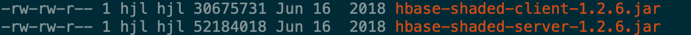
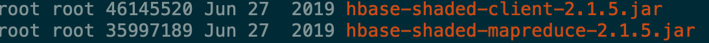
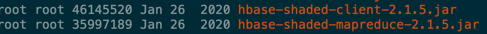
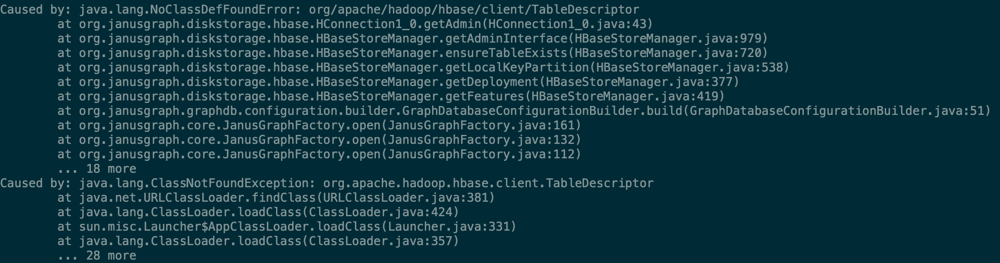

## [Janus0.5](10.106.128.130)

### hbase 版本不匹配

#### JanusGraph-0.2.3


#### JanusGraph-0.3.2



#### JanusGraph-0.4.1



#### JanusGraph-0.5.2



### 启动的YAML文件

#### JanusGraph-0.2.3

```yaml
host: 0.0.0.0
port: 8186
scriptEvaluationTimeout: 500000
channelizer: org.apache.tinkerpop.gremlin.server.channel.WebSocketChannelizer
graphs: {
  graph: conf/index_test.properties
}
plugins:
  - janusgraph.imports
scriptEngines: {
  gremlin-groovy: {
    imports: [java.lang.Math],
    staticImports: [java.lang.Math.PI],
    scripts: [scripts/empty-sample.groovy]}}
serializers:
  - { className: org.apache.tinkerpop.gremlin.driver.ser.GryoMessageSerializerV1d0, config: { ioRegistries: [org.janusgraph.graphdb.tinkerpop.JanusGraphIoRegistry] }}
  - { className: org.apache.tinkerpop.gremlin.driver.ser.GryoLiteMessageSerializerV1d0, config: {ioRegistries: [org.janusgraph.graphdb.tinkerpop.JanusGraphIoRegistry] }}
  - { className: org.apache.tinkerpop.gremlin.driver.ser.GryoMessageSerializerV1d0, config: { serializeResultToString: true }}
  - { className: org.apache.tinkerpop.gremlin.driver.ser.GraphSONMessageSerializerGremlinV1d0, config: { ioRegistries: [org.janusgraph.graphdb.tinkerpop.JanusGraphIoRegistryV1d0] }}
  - { className: org.apache.tinkerpop.gremlin.driver.ser.GraphSONMessageSerializerGremlinV2d0, config: { ioRegistries: [org.janusgraph.graphdb.tinkerpop.JanusGraphIoRegistry] }}
  - { className: org.apache.tinkerpop.gremlin.driver.ser.GraphSONMessageSerializerV1d0, config: { ioRegistries: [org.janusgraph.graphdb.tinkerpop.JanusGraphIoRegistryV1d0] }}
processors:
  - { className: org.apache.tinkerpop.gremlin.server.op.session.SessionOpProcessor, config: { sessionTimeout: 28800000 }}
  - { className: org.apache.tinkerpop.gremlin.server.op.traversal.TraversalOpProcessor, config: { cacheExpirationTime: 600000, cacheMaxSize: 1000 }}
metrics: {
  consoleReporter: {enabled: true, interval: 180000},
  csvReporter: {enabled: true, interval: 180000, fileName: /tmp/gremlin-server-metrics.csv},
  jmxReporter: {enabled: true},
  slf4jReporter: {enabled: true, interval: 180000},
  gangliaReporter: {enabled: false, interval: 180000, addressingMode: MULTICAST},
  graphiteReporter: {enabled: false, interval: 180000}}
maxInitialLineLength: 4096
maxHeaderSize: 8192
maxChunkSize: 8192
maxContentLength: 65536
maxAccumulationBufferComponents: 1024
resultIterationBatchSize: 2000 
writeBufferLowWaterMark: 32768
writeBufferHighWaterMark: 65536
```

#### JanusGraph-0.3.2 以上

```yaml
host: 0.0.0.0
port: 8182
scriptEvaluationTimeout: 30000
channelizer: org.apache.tinkerpop.gremlin.server.channel.WebSocketChannelizer
graphs: {
  graph: conf/janusgraph-hbase.properties
}
scriptEngines: {
  gremlin-groovy: {
    plugins: { org.janusgraph.graphdb.tinkerpop.plugin.JanusGraphGremlinPlugin: { },
               org.apache.tinkerpop.gremlin.server.jsr223.GremlinServerGremlinPlugin: { },
               org.apache.tinkerpop.gremlin.tinkergraph.jsr223.TinkerGraphGremlinPlugin: { },
               org.apache.tinkerpop.gremlin.jsr223.ImportGremlinPlugin: { classImports: [ java.lang.Math ], methodImports: [ java.lang.Math#* ] },
               org.apache.tinkerpop.gremlin.jsr223.ScriptFileGremlinPlugin: { files: [scripts/empty-sample.groovy] } } } }
serializers:
  - { className: org.apache.tinkerpop.gremlin.driver.ser.GryoMessageSerializerV3d0, config: { ioRegistries: [ org.janusgraph.graphdb.tinkerpop.JanusGraphIoRegistry ] } }
  - { className: org.apache.tinkerpop.gremlin.driver.ser.GryoMessageSerializerV3d0, config: { serializeResultToString: true } }
  - { className: org.apache.tinkerpop.gremlin.driver.ser.GraphSONMessageSerializerV3d0, config: { ioRegistries: [ org.janusgraph.graphdb.tinkerpop.JanusGraphIoRegistry ] } }
  - { className: org.apache.tinkerpop.gremlin.driver.ser.GryoMessageSerializerV1d0, config: { ioRegistries: [ org.janusgraph.graphdb.tinkerpop.JanusGraphIoRegistry ] } }
  - { className: org.apache.tinkerpop.gremlin.driver.ser.GryoLiteMessageSerializerV1d0, config: { ioRegistries: [ org.janusgraph.graphdb.tinkerpop.JanusGraphIoRegistry ] } }
  - { className: org.apache.tinkerpop.gremlin.driver.ser.GryoMessageSerializerV1d0, config: { serializeResultToString: true } }
  - { className: org.apache.tinkerpop.gremlin.driver.ser.GraphSONMessageSerializerGremlinV2d0, config: { ioRegistries: [ org.janusgraph.graphdb.tinkerpop.JanusGraphIoRegistry ] } }
  - { className: org.apache.tinkerpop.gremlin.driver.ser.GraphSONMessageSerializerGremlinV1d0, config: { ioRegistries: [ org.janusgraph.graphdb.tinkerpop.JanusGraphIoRegistryV1d0 ] } }
  - { className: org.apache.tinkerpop.gremlin.driver.ser.GraphSONMessageSerializerV1d0, config: { ioRegistries: [ org.janusgraph.graphdb.tinkerpop.JanusGraphIoRegistryV1d0 ] } }
processors:
  - { className: org.apache.tinkerpop.gremlin.server.op.session.SessionOpProcessor, config: { sessionTimeout: 28800000 } }
  - { className: org.apache.tinkerpop.gremlin.server.op.traversal.TraversalOpProcessor, config: { cacheExpirationTime: 600000, cacheMaxSize: 1000 } }
metrics: {
  consoleReporter: { enabled: true, interval: 180000 },
  csvReporter: { enabled: true, interval: 180000, fileName: /tmp/gremlin-server-metrics.csv },
  jmxReporter: { enabled: true },
  slf4jReporter: { enabled: true, interval: 180000 },
  gangliaReporter: { enabled: false, interval: 180000, addressingMode: MULTICAST },
  graphiteReporter: { enabled: false, interval: 180000 } }
maxInitialLineLength: 4096
maxHeaderSize: 8192
maxChunkSize: 8192
maxContentLength: 65536
maxAccumulationBufferComponents: 1024
resultIterationBatchSize: 64
writeBufferLowWaterMark: 32768
writeBufferHighWaterMark: 65536
```

### 启动gremlin-server

#### 指定properties(JanusGraph-0.3.2)文件 -- success

```properties
gremlin.graph=org.janusgraph.core.JanusGraphFactory
storage.backend=hbase
storage.hostname=datanode40.novalocal,datanode42.novalocal,datanode43.novalocal
storage.hbase.ext.zookeeper.znode.parent=/hbase
storage.hbase.ext.hbase.zookeeper.property.clientPort=2181
# 设定skip-schema-check为false会重新建立Hbase表
storage.hbase.skip-schema-check=false
# 重新建Hbase则能成功启动gremlin-server服务
storage.hbase.table=janusgraph0.3.2
storage.hbase.region-count=30
cache.db-cache=true
cache.db-cache-clean-wait=20
cache.db-cache-time=180000
cache.db-cache-size=0.8
ids.block-size=100000000
storage.buffer-size=102400
index.search.backend=elasticsearch
index.search.hostname=10.106.128.131
index.search.port=9200
index.search.index-name=util_0718
```

#### 指定properties(JanusGraph-0.5.2)文件 -- failure

```properties
gremlin.graph=org.janusgraph.core.JanusGraphFactory
storage.backend=hbase
storage.hostname=datanode40.novalocal,datanode42.novalocal,datanode43.novalocal
storage.hbase.ext.zookeeper.znode.parent=/hbase
storage.hbase.ext.hbase.zookeeper.property.clientPort=2181
# 设定skip-schema-check为false会重新建立Hbase表
storage.hbase.skip-schema-check=false
storage.hbase.table=util_0718
storage.hbase.region-count=30
cache.db-cache=true
cache.db-cache-clean-wait=20
cache.db-cache-time=180000
cache.db-cache-size=0.8
ids.block-size=100000000
storage.buffer-size=102400
index.search.backend=elasticsearch
index.search.hostname=10.106.128.131
index.search.port=9200
index.search.index-name=util_0718
```

```log
hbase ERROR
org.apache.hadoop.hbase.regionserver.NoSuchColumnFamilyException: Column family table does not exist in region hbase:meta,,1.1588230740 in table 'hbase:meta'

groovy ERROR
No such property: graph for class: Script1 gremlin-groovy is not an available GremlinScriptEngine
```


### 更换hbase-client版本依赖启动 --failure

使用JanusGraph-0.2.3 
**hbase-shaded-client-1.2.6.jar
hbase-shaded-server-1.2.6.jar**



### 导入数据BatchImport(JanusGraph-0.3.2) -- success

将`pom.xml`中的依赖改成JanusGraph-0.3.2 测试导入 

```xml
<dependency>
  <groupId>org.janusgraph</groupId>
  <artifactId>janusgraph-all</artifactId>
  <version>0.3.2</version>
  <exclusions>
    <exclusion>
      <artifactId>slf4j-log4j12</artifactId>
      <groupId>org.slf4j</groupId>
    </exclusion>
    <exclusion>
      <artifactId>log4j</artifactId>
      <groupId>log4j</groupId>
    </exclusion>
  </exclusions>
</dependency>
```

### 修改GraphWebSocket返回的数据结构

#### gremlin-请求体

```json
{
	"args": {
		"gremlin": "result = g.V().hasLabel('nsr').has('NSRSBH','91331023759085863B').repeat(bothE().otherV().simplePath()).times(1).emit().path().toList()",
		"bindings": {},
		"language": "gremlin-groovy"
	},
	"op": "eval",
	"requestId": "ba939c59-b056-41b5-a42a-10bdb824e16c",
	"processor": ""
}
```

#### JanusGraph-0.3.2

```json
[{
	"result": {
		"data": {
			"@value": [{
				"@value": {
					"objects": {
						"@value": [{
							"@value": {
								"id": {
									"@value": 4144,
									"@type": "g:Int64"
								},
								"label": "nsr"
							},
							"@type": "g:Vertex"
						}, {
							"@value": {
								"inV": {
									"@value": 4144,
									"@type": "g:Int64"
								},
								"inVLabel": "nsr",
								"outVLabel": "person",
								"id": {
									"@value": {
										"relationId": "asn4n-2ilrs-1c7p-374"
									},
									"@type": "janusgraph:RelationIdentifier"
								},
								"label": "control",
								"outV": {
									"@value": 4227256,
									"@type": "g:Int64"
								}
							},
							"@type": "g:Edge"
						}, {
							"@value": {
								"id": {
									"@value": 4227256,
									"@type": "g:Int64"
								},
								"label": "person"
							},
							"@type": "g:Vertex"
						}],
						"@type": "g:List"
					},
					"labels": {
						"@value": [{
							"@value": [],
							"@type": "g:Set"
						}, {
							"@value": [],
							"@type": "g:Set"
						}, {
							"@value": [],
							"@type": "g:Set"
						}],
						"@type": "g:List"
					}
				},
				"@type": "g:Path"
			}, {
				"@value": {
					"objects": {
						"@value": [{
							"@value": {
								"id": {
									"@value": 4144,
									"@type": "g:Int64"
								},
								"label": "nsr"
							},
							"@type": "g:Vertex"
						}, {
							"@value": {
								"inV": {
									"@value": 4144,
									"@type": "g:Int64"
								},
								"inVLabel": "nsr",
								"outVLabel": "person",
								"id": {
									"@value": {
										"relationId": "as3rr-2ilrs-1d05-374"
									},
									"@type": "janusgraph:RelationIdentifier"
								},
								"label": "fincontrol",
								"outV": {
									"@value": 4227256,
									"@type": "g:Int64"
								}
							},
							"@type": "g:Edge"
						}, {
							"@value": {
								"id": {
									"@value": 4227256,
									"@type": "g:Int64"
								},
								"label": "person"
							},
							"@type": "g:Vertex"
						}],
						"@type": "g:List"
					},
					"labels": {
						"@value": [{
							"@value": [],
							"@type": "g:Set"
						}, {
							"@value": [],
							"@type": "g:Set"
						}, {
							"@value": [],
							"@type": "g:Set"
						}],
						"@type": "g:List"
					}
				},
				"@type": "g:Path"
			}, {
				"@value": {
					"objects": {
						"@value": [{
							"@value": {
								"id": {
									"@value": 4144,
									"@type": "g:Int64"
								},
								"label": "nsr"
							},
							"@type": "g:Vertex"
						}, {
							"@value": {
								"inV": {
									"@value": 4144,
									"@type": "g:Int64"
								},
								"inVLabel": "nsr",
								"outVLabel": "person",
								"id": {
									"@value": {
										"relationId": "ar6z2-2k3g0-1dsl-374"
									},
									"@type": "janusgraph:RelationIdentifier"
								},
								"label": "taxcontrol",
								"outV": {
									"@value": 4296816,
									"@type": "g:Int64"
								}
							},
							"@type": "g:Edge"
						}, {
							"@value": {
								"id": {
									"@value": 4296816,
									"@type": "g:Int64"
								},
								"label": "person"
							},
							"@type": "g:Vertex"
						}],
						"@type": "g:List"
					},
					"labels": {
						"@value": [{
							"@value": [],
							"@type": "g:Set"
						}, {
							"@value": [],
							"@type": "g:Set"
						}, {
							"@value": [],
							"@type": "g:Set"
						}],
						"@type": "g:List"
					}
				},
				"@type": "g:Path"
			}],
			"@type": "g:List"
		},
		"meta": {
			"@value": [],
			"@type": "g:Map"
		}
	},
	"requestId": "ba939c59-b056-41b5-a42a-10bdb824e16c",
	"status": {
		"code": 200,
		"attributes": {
			"@value": [],
			"@type": "g:Map"
		},
		"message": ""
	}
}]
```

#### JanusGraph-0.2.3

```json
[{
	"result": {
		"data": [{
			"objects": [{
				"id": 19405053952,
				"label": "nsr",
				"type": "vertex",
				"properties": {
					"SCJYDZ": [{
						"id": "1f9bhlhc-8wx9ngg-7wl",
						"value": "天台县始丰街道济公大道369号"
					}],
					"JYFW": [{
						"id": "1f9bhnuo-8wx9ngg-ft1",
						"value": "机动车维修：二类机动车维修（小型车辆维修）；  汽车、汽车配件销售。"
					}],
					"CUST_CLASS": [{
						"id": "1f9bhp1c-8wx9ngg-hdx",
						"value": "企业"
					}],
					"CWFZR_ZJHM": [{
						"id": "1f9bhqm8-8wx9ngg-q2t",
						"value": "332625197410144411"
					}],
					"ACCOUNT_BANK": [{
						"id": "1f9bhrsw-8wx9ngg-9hh",
						"value": "工行天台支行"
					}],
					"FR_GDDH": [{
						"id": "1f9bhtds-8wx9ngg-mx1",
						"value": "null"
					}],
					"NSRZG_DM": [{
						"id": "1f9bhu68-8wx9ngg-yrp",
						"value": "999"
					}],
					"FR_ZJHM": [{
						"id": "1f9bhvcw-8wx9ngg-m4l",
						"value": "332625197410144411"
					}],
					"BQ": [{
						"id": "1f9bhzpc-8wx9ngg-4qt",
						"value": "nsr"
					}],
					"CWFZR_DZYX": [{
						"id": "1f9bhxc0-8wx9ngg-sg5",
						"value": "null"
					}],
					"CWFZR_MC": [{
						"id": "1f9bi03k-8wx9ngg-pad",
						"value": "陈文辉"
					}],
					"HY": [{
						"id": "1f9bi1og-8wx9ngg-f0l",
						"value": "汽车零售"
					}],
					"FDDBR_MC": [{
						"id": "1f9bi2v4-8wx9ngg-lc5",
						"value": "陈文辉"
					}],
					"NSRZGLX": [{
						"id": "1f9bi4u8-8wx9ngg-zk5",
						"value": "其他纳税人"
					}],
					"NSRZT": [{
						"id": "1f9bi60w-8wx9ngg-xz9",
						"value": "正常"
					}],
					"BSR_ZJHM": [{
						"id": "1f9bi8e8-8wx9ngg-u11",
						"value": "620421198109203617"
					}],
					"BSR_DHHM": [{
						"id": "1f9biadc-8wx9ngg-uth",
						"value": "13736562664"
					}],
					"NSRSBH": [{
						"id": "1f9biolc-8wx9ngg-5j9",
						"value": "91331023759085863B"
					}],
					"PROVINCE_KEY": [{
						"id": "1f9birr4-8wx9ngg-jr9",
						"value": "33"
					}],
					"YDDH": [{
						"id": "1f9biuww-8wx9ngg-35x",
						"value": "13736562664"
					}],
					"FR_YDDH": [{
						"id": "1f9biww0-8wx9ngg-nph",
						"value": "null"
					}],
					"QYGM": [{
						"id": "1f9bj0g0-8wx9ngg-glh",
						"value": "大型"
					}],
					"BSR_DZYX": [{
						"id": "1f9bj3ls-8wx9ngg-wed",
						"value": "662664"
					}],
					"DHHM": [{
						"id": "1f9bj6dc-8wx9ngg-8p1",
						"value": "0576-83178866"
					}],
					"BSR_YDDH": [{
						"id": "1f9bj9j4-8wx9ngg-vlx",
						"value": "13736562664"
					}],
					"CWFZR_YDDH": [{
						"id": "1f9bjb40-8wx9ngg-rnp",
						"value": "null"
					}],
					"NSRZT_DM": [{
						"id": "1f9bje9s-8wx9ngg-x6t",
						"value": "03"
					}],
					"REGION_KEY": [{
						"id": "1f9bjh1c-8wx9ngg-i6d",
						"value": "331023"
					}],
					"PROVINCE_NAME": [{
						"id": "1f9bjnr4-8wx9ngg-kjp",
						"value": "浙江省"
					}],
					"BSR_MC": [{
						"id": "1f9bjpc0-8wx9ngg-t8l",
						"value": "王爱伟"
					}],
					"DJZCLX_DM": [{
						"id": "1f9bjs3k-8wx9ngg-cn9",
						"value": "159"
					}],
					"CWFZR_GDDH": [{
						"id": "1f9bjvnk-8wx9ngg-qv9",
						"value": "null"
					}],
					"NSRMC": [{
						"id": "1f9bk0sg-8wx9ngg-6bp",
						"value": "天台县子平汽车销售服务有限公司"
					}],
					"KYDJRQ": [{
						"id": "1f9bk35s-8wx9ngg-b2d",
						"value": "2004-03-2500:00:00.0"
					}],
					"REGION_NAME": [{
						"id": "1f9bk740-8wx9ngg-iyt",
						"value": "天台县"
					}],
					"FR_DZYX": [{
						"id": "1f9bkbuo-8wx9ngg-ohx",
						"value": "null"
					}],
					"ADDRESS": [{
						"id": "1f9bkg74-8wx9ngg-745",
						"value": "台州市天台县始丰街道济公大道339号"
					}],
					"ACCOUNT_CODE": [{
						"id": "1f9bkjr4-8wx9ngg-a9x",
						"value": "1207061119201132980"
					}],
					"ZCZB": [{
						"id": "1f9bkpa8-8wx9ngg-but",
						"value": "2.5E7"
					}],
					"HYDM": [{
						"id": "1f9bkxz4-8wx9ngg-e85",
						"value": "5261"
					}],
					"SOURCE": [{
						"id": "1f9bl6o0-8wx9ngg-11xh",
						"value": "TC"
					}],
					"SWJG_KEY": [{
						"id": "1f9blclc-8wx9ngg-10cl",
						"value": "13310230000"
					}],
					"SWJG_MC": [{
						"id": "1f9blgjk-8wx9ngg-1151",
						"value": "天台县国家税务局"
					}],
					"DJZCLX": [{
						"id": "1f9blla8-8wx9ngg-dfp",
						"value": "其他有限责任公司"
					}]
				}
			}, {
				"inV": 19405053952,
				"inVLabel": "nsr",
				"outVLabel": "person",
				"id": "2am4ob28-d1vi2gw-1c7p-8wx9ngg",
				"label": "control",
				"type": "edge",
				"outV": 28411547648,
				"properties": {
					"NSRSBH": "91331023759085863B",
					"FR_ZJHM": "332625197410144411",
					"BQ": "control"
				}
			}, {
				"id": 28411547648,
				"label": "person",
				"type": "vertex",
				"properties": {
					"GDDH": [{
						"id": "20bxsqv4-d1vi2gw-2dh",
						"value": "18057636888"
					}],
					"DZYX": [{
						"id": "20bxsr9c-d1vi2gw-3yd",
						"value": "null"
					}],
					"MC": [{
						"id": "20bxsrnk-d1vi2gw-1l1",
						"value": "陈文辉"
					}],
					"YDDH": [{
						"id": "20bxss1s-d1vi2gw-35x",
						"value": "18057636888"
					}],
					"ZJHM": [{
						"id": "20bxssg0-d1vi2gw-sl",
						"value": "332625197410144411"
					}],
					"BQ": [{
						"id": "20bxssu8-d1vi2gw-4qt",
						"value": "person"
					}]
				}
			}],
			"labels": [
				[],
				[],
				[]
			]
		}, {
			"objects": [{
				"id": 19405053952,
				"label": "nsr",
				"type": "vertex",
				"properties": {
					"SCJYDZ": [{
						"id": "1f9bhlhc-8wx9ngg-7wl",
						"value": "天台县始丰街道济公大道369号"
					}],
					"JYFW": [{
						"id": "1f9bhnuo-8wx9ngg-ft1",
						"value": "机动车维修：二类机动车维修（小型车辆维修）；  汽车、汽车配件销售。"
					}],
					"CUST_CLASS": [{
						"id": "1f9bhp1c-8wx9ngg-hdx",
						"value": "企业"
					}],
					"CWFZR_ZJHM": [{
						"id": "1f9bhqm8-8wx9ngg-q2t",
						"value": "332625197410144411"
					}],
					"ACCOUNT_BANK": [{
						"id": "1f9bhrsw-8wx9ngg-9hh",
						"value": "工行天台支行"
					}],
					"FR_GDDH": [{
						"id": "1f9bhtds-8wx9ngg-mx1",
						"value": "null"
					}],
					"NSRZG_DM": [{
						"id": "1f9bhu68-8wx9ngg-yrp",
						"value": "999"
					}],
					"FR_ZJHM": [{
						"id": "1f9bhvcw-8wx9ngg-m4l",
						"value": "332625197410144411"
					}],
					"BQ": [{
						"id": "1f9bhzpc-8wx9ngg-4qt",
						"value": "nsr"
					}],
					"CWFZR_DZYX": [{
						"id": "1f9bhxc0-8wx9ngg-sg5",
						"value": "null"
					}],
					"CWFZR_MC": [{
						"id": "1f9bi03k-8wx9ngg-pad",
						"value": "陈文辉"
					}],
					"HY": [{
						"id": "1f9bi1og-8wx9ngg-f0l",
						"value": "汽车零售"
					}],
					"FDDBR_MC": [{
						"id": "1f9bi2v4-8wx9ngg-lc5",
						"value": "陈文辉"
					}],
					"NSRZGLX": [{
						"id": "1f9bi4u8-8wx9ngg-zk5",
						"value": "其他纳税人"
					}],
					"NSRZT": [{
						"id": "1f9bi60w-8wx9ngg-xz9",
						"value": "正常"
					}],
					"BSR_ZJHM": [{
						"id": "1f9bi8e8-8wx9ngg-u11",
						"value": "620421198109203617"
					}],
					"BSR_DHHM": [{
						"id": "1f9biadc-8wx9ngg-uth",
						"value": "13736562664"
					}],
					"NSRSBH": [{
						"id": "1f9biolc-8wx9ngg-5j9",
						"value": "91331023759085863B"
					}],
					"PROVINCE_KEY": [{
						"id": "1f9birr4-8wx9ngg-jr9",
						"value": "33"
					}],
					"YDDH": [{
						"id": "1f9biuww-8wx9ngg-35x",
						"value": "13736562664"
					}],
					"FR_YDDH": [{
						"id": "1f9biww0-8wx9ngg-nph",
						"value": "null"
					}],
					"QYGM": [{
						"id": "1f9bj0g0-8wx9ngg-glh",
						"value": "大型"
					}],
					"BSR_DZYX": [{
						"id": "1f9bj3ls-8wx9ngg-wed",
						"value": "662664"
					}],
					"DHHM": [{
						"id": "1f9bj6dc-8wx9ngg-8p1",
						"value": "0576-83178866"
					}],
					"BSR_YDDH": [{
						"id": "1f9bj9j4-8wx9ngg-vlx",
						"value": "13736562664"
					}],
					"CWFZR_YDDH": [{
						"id": "1f9bjb40-8wx9ngg-rnp",
						"value": "null"
					}],
					"NSRZT_DM": [{
						"id": "1f9bje9s-8wx9ngg-x6t",
						"value": "03"
					}],
					"REGION_KEY": [{
						"id": "1f9bjh1c-8wx9ngg-i6d",
						"value": "331023"
					}],
					"PROVINCE_NAME": [{
						"id": "1f9bjnr4-8wx9ngg-kjp",
						"value": "浙江省"
					}],
					"BSR_MC": [{
						"id": "1f9bjpc0-8wx9ngg-t8l",
						"value": "王爱伟"
					}],
					"DJZCLX_DM": [{
						"id": "1f9bjs3k-8wx9ngg-cn9",
						"value": "159"
					}],
					"CWFZR_GDDH": [{
						"id": "1f9bjvnk-8wx9ngg-qv9",
						"value": "null"
					}],
					"NSRMC": [{
						"id": "1f9bk0sg-8wx9ngg-6bp",
						"value": "天台县子平汽车销售服务有限公司"
					}],
					"KYDJRQ": [{
						"id": "1f9bk35s-8wx9ngg-b2d",
						"value": "2004-03-2500:00:00.0"
					}],
					"REGION_NAME": [{
						"id": "1f9bk740-8wx9ngg-iyt",
						"value": "天台县"
					}],
					"FR_DZYX": [{
						"id": "1f9bkbuo-8wx9ngg-ohx",
						"value": "null"
					}],
					"ADDRESS": [{
						"id": "1f9bkg74-8wx9ngg-745",
						"value": "台州市天台县始丰街道济公大道339号"
					}],
					"ACCOUNT_CODE": [{
						"id": "1f9bkjr4-8wx9ngg-a9x",
						"value": "1207061119201132980"
					}],
					"ZCZB": [{
						"id": "1f9bkpa8-8wx9ngg-but",
						"value": "2.5E7"
					}],
					"HYDM": [{
						"id": "1f9bkxz4-8wx9ngg-e85",
						"value": "5261"
					}],
					"SOURCE": [{
						"id": "1f9bl6o0-8wx9ngg-11xh",
						"value": "TC"
					}],
					"SWJG_KEY": [{
						"id": "1f9blclc-8wx9ngg-10cl",
						"value": "13310230000"
					}],
					"SWJG_MC": [{
						"id": "1f9blgjk-8wx9ngg-1151",
						"value": "天台县国家税务局"
					}],
					"DJZCLX": [{
						"id": "1f9blla8-8wx9ngg-dfp",
						"value": "其他有限责任公司"
					}]
				}
			}, {
				"inV": 19405053952,
				"inVLabel": "nsr",
				"outVLabel": "person",
				"id": "29ii4jy8-d1vi2gw-1d05-8wx9ngg",
				"label": "fincontrol",
				"type": "edge",
				"outV": 28411547648,
				"properties": {
					"CWFZR_ZJHM": "332625197410144411",
					"NSRSBH": "91331023759085863B",
					"BQ": "fincontrol"
				}
			}, {
				"id": 28411547648,
				"label": "person",
				"type": "vertex",
				"properties": {
					"GDDH": [{
						"id": "20bxsqv4-d1vi2gw-2dh",
						"value": "18057636888"
					}],
					"DZYX": [{
						"id": "20bxsr9c-d1vi2gw-3yd",
						"value": "null"
					}],
					"MC": [{
						"id": "20bxsrnk-d1vi2gw-1l1",
						"value": "陈文辉"
					}],
					"YDDH": [{
						"id": "20bxss1s-d1vi2gw-35x",
						"value": "18057636888"
					}],
					"ZJHM": [{
						"id": "20bxssg0-d1vi2gw-sl",
						"value": "332625197410144411"
					}],
					"BQ": [{
						"id": "20bxssu8-d1vi2gw-4qt",
						"value": "person"
					}]
				}
			}],
			"labels": [
				[],
				[],
				[]
			]
		}, {
			"objects": [{
				"id": 19405053952,
				"label": "nsr",
				"type": "vertex",
				"properties": {
					"SCJYDZ": [{
						"id": "1f9bhlhc-8wx9ngg-7wl",
						"value": "天台县始丰街道济公大道369号"
					}],
					"JYFW": [{
						"id": "1f9bhnuo-8wx9ngg-ft1",
						"value": "机动车维修：二类机动车维修（小型车辆维修）；  汽车、汽车配件销售。"
					}],
					"CUST_CLASS": [{
						"id": "1f9bhp1c-8wx9ngg-hdx",
						"value": "企业"
					}],
					"CWFZR_ZJHM": [{
						"id": "1f9bhqm8-8wx9ngg-q2t",
						"value": "332625197410144411"
					}],
					"ACCOUNT_BANK": [{
						"id": "1f9bhrsw-8wx9ngg-9hh",
						"value": "工行天台支行"
					}],
					"FR_GDDH": [{
						"id": "1f9bhtds-8wx9ngg-mx1",
						"value": "null"
					}],
					"NSRZG_DM": [{
						"id": "1f9bhu68-8wx9ngg-yrp",
						"value": "999"
					}],
					"FR_ZJHM": [{
						"id": "1f9bhvcw-8wx9ngg-m4l",
						"value": "332625197410144411"
					}],
					"BQ": [{
						"id": "1f9bhzpc-8wx9ngg-4qt",
						"value": "nsr"
					}],
					"CWFZR_DZYX": [{
						"id": "1f9bhxc0-8wx9ngg-sg5",
						"value": "null"
					}],
					"CWFZR_MC": [{
						"id": "1f9bi03k-8wx9ngg-pad",
						"value": "陈文辉"
					}],
					"HY": [{
						"id": "1f9bi1og-8wx9ngg-f0l",
						"value": "汽车零售"
					}],
					"FDDBR_MC": [{
						"id": "1f9bi2v4-8wx9ngg-lc5",
						"value": "陈文辉"
					}],
					"NSRZGLX": [{
						"id": "1f9bi4u8-8wx9ngg-zk5",
						"value": "其他纳税人"
					}],
					"NSRZT": [{
						"id": "1f9bi60w-8wx9ngg-xz9",
						"value": "正常"
					}],
					"BSR_ZJHM": [{
						"id": "1f9bi8e8-8wx9ngg-u11",
						"value": "620421198109203617"
					}],
					"BSR_DHHM": [{
						"id": "1f9biadc-8wx9ngg-uth",
						"value": "13736562664"
					}],
					"NSRSBH": [{
						"id": "1f9biolc-8wx9ngg-5j9",
						"value": "91331023759085863B"
					}],
					"PROVINCE_KEY": [{
						"id": "1f9birr4-8wx9ngg-jr9",
						"value": "33"
					}],
					"YDDH": [{
						"id": "1f9biuww-8wx9ngg-35x",
						"value": "13736562664"
					}],
					"FR_YDDH": [{
						"id": "1f9biww0-8wx9ngg-nph",
						"value": "null"
					}],
					"QYGM": [{
						"id": "1f9bj0g0-8wx9ngg-glh",
						"value": "大型"
					}],
					"BSR_DZYX": [{
						"id": "1f9bj3ls-8wx9ngg-wed",
						"value": "662664"
					}],
					"DHHM": [{
						"id": "1f9bj6dc-8wx9ngg-8p1",
						"value": "0576-83178866"
					}],
					"BSR_YDDH": [{
						"id": "1f9bj9j4-8wx9ngg-vlx",
						"value": "13736562664"
					}],
					"CWFZR_YDDH": [{
						"id": "1f9bjb40-8wx9ngg-rnp",
						"value": "null"
					}],
					"NSRZT_DM": [{
						"id": "1f9bje9s-8wx9ngg-x6t",
						"value": "03"
					}],
					"REGION_KEY": [{
						"id": "1f9bjh1c-8wx9ngg-i6d",
						"value": "331023"
					}],
					"PROVINCE_NAME": [{
						"id": "1f9bjnr4-8wx9ngg-kjp",
						"value": "浙江省"
					}],
					"BSR_MC": [{
						"id": "1f9bjpc0-8wx9ngg-t8l",
						"value": "王爱伟"
					}],
					"DJZCLX_DM": [{
						"id": "1f9bjs3k-8wx9ngg-cn9",
						"value": "159"
					}],
					"CWFZR_GDDH": [{
						"id": "1f9bjvnk-8wx9ngg-qv9",
						"value": "null"
					}],
					"NSRMC": [{
						"id": "1f9bk0sg-8wx9ngg-6bp",
						"value": "天台县子平汽车销售服务有限公司"
					}],
					"KYDJRQ": [{
						"id": "1f9bk35s-8wx9ngg-b2d",
						"value": "2004-03-2500:00:00.0"
					}],
					"REGION_NAME": [{
						"id": "1f9bk740-8wx9ngg-iyt",
						"value": "天台县"
					}],
					"FR_DZYX": [{
						"id": "1f9bkbuo-8wx9ngg-ohx",
						"value": "null"
					}],
					"ADDRESS": [{
						"id": "1f9bkg74-8wx9ngg-745",
						"value": "台州市天台县始丰街道济公大道339号"
					}],
					"ACCOUNT_CODE": [{
						"id": "1f9bkjr4-8wx9ngg-a9x",
						"value": "1207061119201132980"
					}],
					"ZCZB": [{
						"id": "1f9bkpa8-8wx9ngg-but",
						"value": "2.5E7"
					}],
					"HYDM": [{
						"id": "1f9bkxz4-8wx9ngg-e85",
						"value": "5261"
					}],
					"SOURCE": [{
						"id": "1f9bl6o0-8wx9ngg-11xh",
						"value": "TC"
					}],
					"SWJG_KEY": [{
						"id": "1f9blclc-8wx9ngg-10cl",
						"value": "13310230000"
					}],
					"SWJG_MC": [{
						"id": "1f9blgjk-8wx9ngg-1151",
						"value": "天台县国家税务局"
					}],
					"DJZCLX": [{
						"id": "1f9blla8-8wx9ngg-dfp",
						"value": "其他有限责任公司"
					}]
				}
			}, {
				"inV": 19405053952,
				"inVLabel": "nsr",
				"outVLabel": "person",
				"id": "29kjyio0-h1l54ow-1dsl-8wx9ngg",
				"label": "taxcontrol",
				"type": "edge",
				"outV": 37101277184,
				"properties": {
					"BSR_ZJHM": "620421198109203617",
					"NSRSBH": "91331023759085863B",
					"BQ": "taxcontrol"
				}
			}, {
				"id": 37101277184,
				"label": "person",
				"type": "vertex",
				"properties": {
					"GDDH": [{
						"id": "24bnfny8-h1l54ow-2dh",
						"value": "13736562664"
					}],
					"DZYX": [{
						"id": "24bnfpj4-h1l54ow-3yd",
						"value": "662664"
					}],
					"MC": [{
						"id": "24bnfr40-h1l54ow-1l1",
						"value": "王爱伟"
					}],
					"YDDH": [{
						"id": "24bnfsao-h1l54ow-35x",
						"value": "13736562664"
					}],
					"ZJHM": [{
						"id": "24bng45c-h1l54ow-sl",
						"value": "620421198109203617"
					}],
					"BQ": [{
						"id": "24bng9a8-h1l54ow-4qt",
						"value": "person"
					}]
				}
			}],
			"labels": [
				[],
				[],
				[]
			]
		}],
		"meta": {}
	},
	"requestId": "6918f928-4d9d-4bea-9a1f-2f5af5bfed6f",
	"status": {
		"code": 200,
		"attributes": {},
		"message": ""
	}
}]
```
#### gremlin-请求体

```json
{
	"args": {
		"gremlin": "result=g.V().hasLabel('person').has('MC','章汉楷').valueMap()",
		"bindings": {},
		"language": "gremlin-groovy"
	},
	"op": "eval",
	"requestId": "5e56e6e1-ee15-4d65-bdf4-cc6c0dc0b64f",
	"processor": ""
}
```
#### JanusGraph-0.2.3

```json
[{
	"result": {
		"data": [{
			"GDDH": ["null"],
			"DZYX": ["null"],
			"MC": ["章汉楷"],
			"YDDH": ["null"],
			"ZJHM": ["330107740306091"],
			"BQ": ["person"]
		}, {
			"GDDH": ["null"],
			"DZYX": ["null"],
			"MC": ["章汉楷"],
			"YDDH": ["null"],
			"ZJHM": ["330107197403060912"],
			"BQ": ["person"]
		}],
		"meta": {}
	},
	"requestId": "5e56e6e1-ee15-4d65-bdf4-cc6c0dc0b64f",
	"status": {
		"code": 200,
		"attributes": {},
		"message": ""
	}
}]
```

#### JanusGraph-0.3.2

```json
[{
	"result": {
		"data": {
			"@value": [{
				"@value": ["GDDH", {
					"@value": ["null"],
					"@type": "g:List"
				}, "DZYX", {
					"@value": ["null"],
					"@type": "g:List"
				}, "MC", {
					"@value": ["章汉楷"],
					"@type": "g:List"
				}, "YDDH", {
					"@value": ["null"],
					"@type": "g:List"
				}, "ZJHM", {
					"@value": ["330107197403060912"],
					"@type": "g:List"
				}, "BQ", {
					"@value": ["person"],
					"@type": "g:List"
				}],
				"@type": "g:Map"
			}],
			"@type": "g:List"
		},
		"meta": {
			"@value": [],
			"@type": "g:Map"
		}
	},
	"requestId": "fff07249-f1a8-45dc-8034-edc98941afe1",
	"status": {
		"code": 200,
		"attributes": {
			"@value": [],
			"@type": "g:Map"
		},
		"message": ""
	}
}]
```