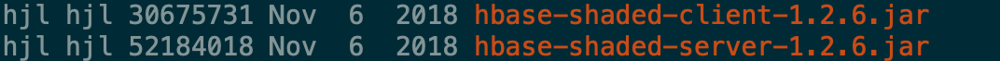

## [Janus0.5](10.106.128.130)

### hbase 版本不匹配

#### JanusGraph-0.2.3



#### JanusGraph-0.3.2


#### JanusGraph-0.4.1


#### JanusGraph-0.5.2


### 启动的YAML文件

#### JanusGraph-0.2.3

```yaml
host: 0.0.0.0
port: 8186
scriptEvaluationTimeout: 500000
channelizer: org.apache.tinkerpop.gremlin.server.channel.WebSocketChannelizer
graphs: {
  graph: conf/index_test.properties
}
plugins:
  - janusgraph.imports
scriptEngines: {
  gremlin-groovy: {
    imports: [java.lang.Math],
    staticImports: [java.lang.Math.PI],
    scripts: [scripts/empty-sample.groovy]}}
serializers:
  - { className: org.apache.tinkerpop.gremlin.driver.ser.GryoMessageSerializerV1d0, config: { ioRegistries: [org.janusgraph.graphdb.tinkerpop.JanusGraphIoRegistry] }}
  - { className: org.apache.tinkerpop.gremlin.driver.ser.GryoLiteMessageSerializerV1d0, config: {ioRegistries: [org.janusgraph.graphdb.tinkerpop.JanusGraphIoRegistry] }}
  - { className: org.apache.tinkerpop.gremlin.driver.ser.GryoMessageSerializerV1d0, config: { serializeResultToString: true }}
  - { className: org.apache.tinkerpop.gremlin.driver.ser.GraphSONMessageSerializerGremlinV1d0, config: { ioRegistries: [org.janusgraph.graphdb.tinkerpop.JanusGraphIoRegistryV1d0] }}
  - { className: org.apache.tinkerpop.gremlin.driver.ser.GraphSONMessageSerializerGremlinV2d0, config: { ioRegistries: [org.janusgraph.graphdb.tinkerpop.JanusGraphIoRegistry] }}
  - { className: org.apache.tinkerpop.gremlin.driver.ser.GraphSONMessageSerializerV1d0, config: { ioRegistries: [org.janusgraph.graphdb.tinkerpop.JanusGraphIoRegistryV1d0] }}
processors:
  - { className: org.apache.tinkerpop.gremlin.server.op.session.SessionOpProcessor, config: { sessionTimeout: 28800000 }}
  - { className: org.apache.tinkerpop.gremlin.server.op.traversal.TraversalOpProcessor, config: { cacheExpirationTime: 600000, cacheMaxSize: 1000 }}
metrics: {
  consoleReporter: {enabled: true, interval: 180000},
  csvReporter: {enabled: true, interval: 180000, fileName: /tmp/gremlin-server-metrics.csv},
  jmxReporter: {enabled: true},
  slf4jReporter: {enabled: true, interval: 180000},
  gangliaReporter: {enabled: false, interval: 180000, addressingMode: MULTICAST},
  graphiteReporter: {enabled: false, interval: 180000}}
maxInitialLineLength: 4096
maxHeaderSize: 8192
maxChunkSize: 8192
maxContentLength: 65536
maxAccumulationBufferComponents: 1024
resultIterationBatchSize: 2000 
writeBufferLowWaterMark: 32768
writeBufferHighWaterMark: 65536
```

#### JanusGraph-0.3.2 以上

```yaml
host: 0.0.0.0
port: 8182
scriptEvaluationTimeout: 30000
channelizer: org.apache.tinkerpop.gremlin.server.channel.WebSocketChannelizer
graphs: {
  graph: conf/janusgraph-hbase.properties
}
scriptEngines: {
  gremlin-groovy: {
    plugins: { org.janusgraph.graphdb.tinkerpop.plugin.JanusGraphGremlinPlugin: { },
               org.apache.tinkerpop.gremlin.server.jsr223.GremlinServerGremlinPlugin: { },
               org.apache.tinkerpop.gremlin.tinkergraph.jsr223.TinkerGraphGremlinPlugin: { },
               org.apache.tinkerpop.gremlin.jsr223.ImportGremlinPlugin: { classImports: [ java.lang.Math ], methodImports: [ java.lang.Math#* ] },
               org.apache.tinkerpop.gremlin.jsr223.ScriptFileGremlinPlugin: { files: [scripts/empty-sample.groovy] } } } }
serializers:
  - { className: org.apache.tinkerpop.gremlin.driver.ser.GryoMessageSerializerV3d0, config: { ioRegistries: [ org.janusgraph.graphdb.tinkerpop.JanusGraphIoRegistry ] } }
  - { className: org.apache.tinkerpop.gremlin.driver.ser.GryoMessageSerializerV3d0, config: { serializeResultToString: true } }
  - { className: org.apache.tinkerpop.gremlin.driver.ser.GraphSONMessageSerializerV3d0, config: { ioRegistries: [ org.janusgraph.graphdb.tinkerpop.JanusGraphIoRegistry ] } }
  - { className: org.apache.tinkerpop.gremlin.driver.ser.GryoMessageSerializerV1d0, config: { ioRegistries: [ org.janusgraph.graphdb.tinkerpop.JanusGraphIoRegistry ] } }
  - { className: org.apache.tinkerpop.gremlin.driver.ser.GryoLiteMessageSerializerV1d0, config: { ioRegistries: [ org.janusgraph.graphdb.tinkerpop.JanusGraphIoRegistry ] } }
  - { className: org.apache.tinkerpop.gremlin.driver.ser.GryoMessageSerializerV1d0, config: { serializeResultToString: true } }
  - { className: org.apache.tinkerpop.gremlin.driver.ser.GraphSONMessageSerializerGremlinV2d0, config: { ioRegistries: [ org.janusgraph.graphdb.tinkerpop.JanusGraphIoRegistry ] } }
  - { className: org.apache.tinkerpop.gremlin.driver.ser.GraphSONMessageSerializerGremlinV1d0, config: { ioRegistries: [ org.janusgraph.graphdb.tinkerpop.JanusGraphIoRegistryV1d0 ] } }
  - { className: org.apache.tinkerpop.gremlin.driver.ser.GraphSONMessageSerializerV1d0, config: { ioRegistries: [ org.janusgraph.graphdb.tinkerpop.JanusGraphIoRegistryV1d0 ] } }
processors:
  - { className: org.apache.tinkerpop.gremlin.server.op.session.SessionOpProcessor, config: { sessionTimeout: 28800000 } }
  - { className: org.apache.tinkerpop.gremlin.server.op.traversal.TraversalOpProcessor, config: { cacheExpirationTime: 600000, cacheMaxSize: 1000 } }
metrics: {
  consoleReporter: { enabled: true, interval: 180000 },
  csvReporter: { enabled: true, interval: 180000, fileName: /tmp/gremlin-server-metrics.csv },
  jmxReporter: { enabled: true },
  slf4jReporter: { enabled: true, interval: 180000 },
  gangliaReporter: { enabled: false, interval: 180000, addressingMode: MULTICAST },
  graphiteReporter: { enabled: false, interval: 180000 } }
maxInitialLineLength: 4096
maxHeaderSize: 8192
maxChunkSize: 8192
maxContentLength: 65536
maxAccumulationBufferComponents: 1024
resultIterationBatchSize: 64
writeBufferLowWaterMark: 32768
writeBufferHighWaterMark: 65536
```

### 启动gremlin-server

#### 指定properties(JanusGraph-0.2.3)文件 -- failure

```properties
gremlin.graph=org.janusgraph.core.JanusGraphFactory
storage.backend=hbase
storage.hostname=datanode40.novalocal,datanode42.novalocal,datanode43.novalocal
storage.hbase.ext.zookeeper.znode.parent=/hbase
storage.hbase.ext.hbase.zookeeper.property.clientPort=2181
# 如果properties中指定table是原本存在的则会出现如下错误
storage.hbase.table=util_0718
storage.hbase.region-count=30
cache.db-cache=true
cache.db-cache-clean-wait=20
cache.db-cache-time=180000
cache.db-cache-size=0.8
ids.block-size=100000000
storage.buffer-size=102400
index.search.backend=elasticsearch
index.search.hostname=10.106.128.131
index.search.port=9200
index.search.index-name=util_0718
```

```log
javax.script.ScriptException: groovy.lang.MissingPropertyException: No such property: graph for class: Script1
Caused by: java.lang.IllegalArgumentException: gremlin-groovy is not an available GremlinScriptEngine
```

#### 指定properties(JanusGraph-0.3.2)文件 -- success

```properties
gremlin.graph=org.janusgraph.core.JanusGraphFactory
storage.backend=hbase
storage.hostname=datanode40.novalocal,datanode42.novalocal,datanode43.novalocal
storage.hbase.ext.zookeeper.znode.parent=/hbase
storage.hbase.ext.hbase.zookeeper.property.clientPort=2181
# 设定skip-schema-check为false会重新建立Hbase表
storage.hbase.skip-schema-check=false
# 重新建Hbase则能成功启动gremlin-server服务
storage.hbase.table=janusgraph0.3.2
storage.hbase.region-count=30
cache.db-cache=true
cache.db-cache-clean-wait=20
cache.db-cache-time=180000
cache.db-cache-size=0.8
ids.block-size=100000000
storage.buffer-size=102400
index.search.backend=elasticsearch
index.search.hostname=10.106.128.131
index.search.port=9200
index.search.index-name=util_0718
```

#### 指定properties(JanusGraph-0.5.2)文件 -- failure

```properties
gremlin.graph=org.janusgraph.core.JanusGraphFactory
storage.backend=hbase
storage.hostname=datanode40.novalocal,datanode42.novalocal,datanode43.novalocal
storage.hbase.ext.zookeeper.znode.parent=/hbase
storage.hbase.ext.hbase.zookeeper.property.clientPort=2181
# 设定skip-schema-check为false会重新建立Hbase表
storage.hbase.skip-schema-check=false
# 重新建Hbase则能成功启动gremlin-server服务
storage.hbase.table=janusgraph0.5.2
storage.hbase.region-count=30
cache.db-cache=true
cache.db-cache-clean-wait=20
cache.db-cache-time=180000
cache.db-cache-size=0.8
ids.block-size=100000000
storage.buffer-size=102400
index.search.backend=elasticsearch
index.search.hostname=10.106.128.131
index.search.port=9200
index.search.index-name=util_0718
```

```log
javax.script.ScriptException: groovy.lang.MissingPropertyException: No such property: graph for class: Script1
Caused by: java.lang.IllegalArgumentException: gremlin-groovy is not an available GremlinScriptEngine
```

### 导入数据BatchImport(JanusGraph-0.3.2)

./run.sh import /Users/hujiale/ProgramFiles/janusgraph-0.3.2-hadoop2/conf/janusgraph-cassandra-es.properties /Users/hujiale/IdeaProjects/aisino_graph/janusgraph-utils/aisino-data-test /Users/hujiale/IdeaProjects/aisino_graph/janusgraph-utils/aisino-conf/utiltest_schema.json /Users/hujiale/IdeaProjects/aisino_graph/janusgraph-utils/aisino-conf/utiltest_datamapper.json